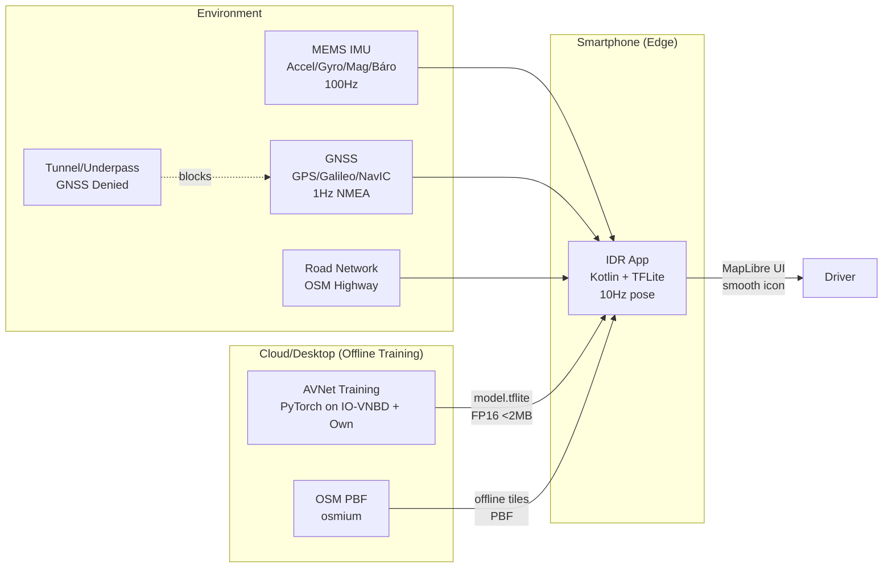
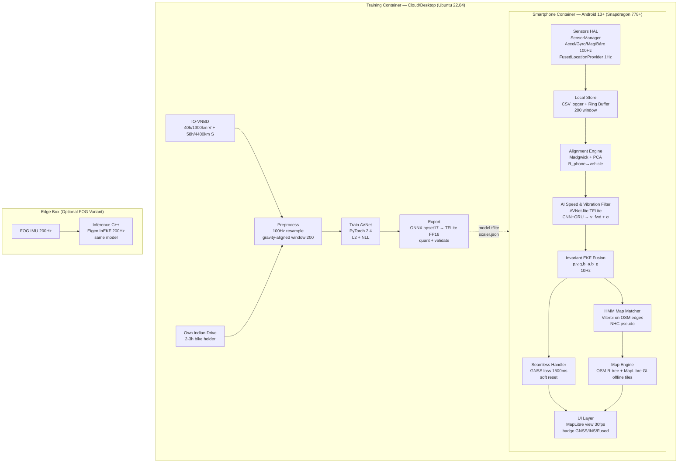
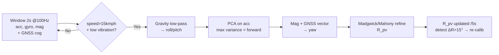
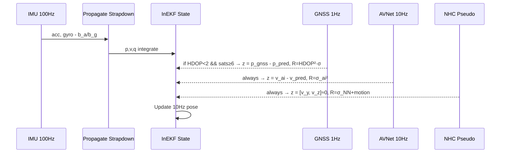
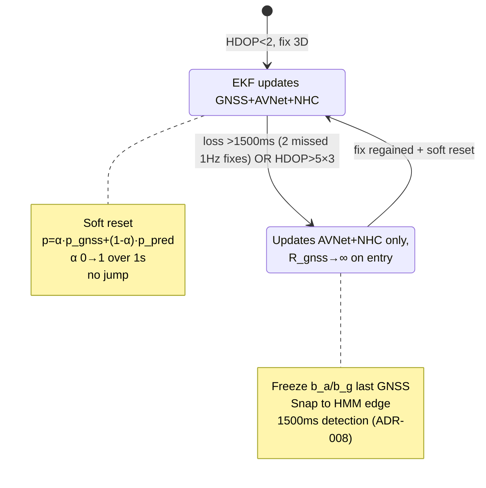
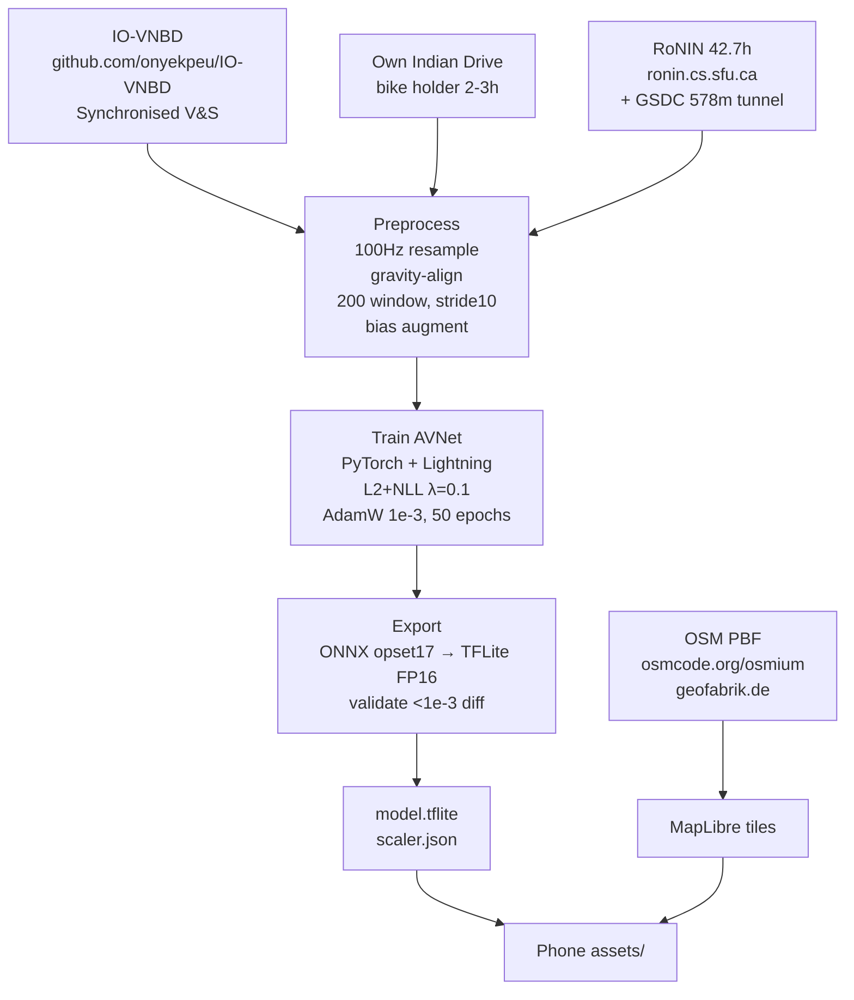

# Architecture — SIH26168 Intelligent Dead Reckoning (IDR) + AI GNSS/INS Fusion

> **Source PS:** [SIH26168](https://github.com/vedantchalke36/sih-2026-problem-statements/blob/main/ps_2026/SIH26168.md) · [IO-VNBD](https://github.com/onyekpeu/IO-VNBD) · [Main README](../README.md)  
> **Stack:** Cloud Training ([PyTorch](https://pytorch.org/)) → Edge Inference ([TFLite](https://www.tensorflow.org/lite) on [Android](https://developer.android.com/)) · Offline [OSM](https://www.openstreetmap.org) · No cloud at finale

---

## 1. System Context (C1)



**Actors:** Driver (sees uninterrupted icon), ISRO Judge (simulates outage via Faraday mask), Training Engineer (pre-finale).

**Constraints from PS:** Phone-only, no OBD-II, must work with any external IMU (FOG @200Hz), milliseconds handover, 10Hz phone / 200Hz edge.

---

## 2. Container Diagram (C2)



---

## 3. Component Deep-Dive

### 3.1 Alignment Engine — Phone → Vehicle Frame



*   **[Links]:** [Madgwick AHRS](https://x-io.co.uk/open-source-imu-and-ahrs-algorithms/) · [PCA](https://en.wikipedia.org/wiki/Principal_component_analysis) · [Android SensorManager](https://developer.android.com/reference/android/hardware/SensorManager)
*   Output `R_pv` rotates every IMU sample to vehicle frame before AVNet — matches [RoNIN](https://github.com/Sachini/ronin) gravity-aligned trick.

### 3.2 AVNet-lite — AI Speed & Vibration Filter

```
Input: 200×6 (acc 3 + gyro 3, gravity-aligned, @100Hz = 2s)
  │
  ├─► 1D-CNN: Conv1d 6→32 k9 dilated=1 → BN → ReLU
  │           Conv1d 32→64 k9 dilated=2 → BN → ReLU
  │           → MaxPool 2 → Dropout 0.1
  │
  ├─► GRU: 2 layers ×64 hidden, seq_len 100 → last hidden
  │
  └─► FC: 64→32 → ReLU → Dropout → 32→2 (v_fwd, logσ)
       Loss: L = ||v_pred - v_gt||² + λ·NLL(v_pred, σ)
       Params: ~150k, FP16 <1.2MB, <8ms on SD778 via NNAPI
```

*   Training augmentation: inject `2–15g` pothole spikes @20–80Hz + engine harmonics from own data — model learns to ignore vs classical low-pass.
*   **Links:** [CNN](https://en.wikipedia.org/wiki/Convolutional_neural_network) · [GRU](https://en.wikipedia.org/wiki/Gated_recurrent_unit) · [NLL](https://en.wikipedia.org/wiki/Likelihood_function) · [TFLite](https://www.tensorflow.org/lite) · [NNAPI](https://developer.android.com/ndk/guides/neuralnetworks)
*   Window stride 10 → 10Hz velocity output, feeds EKF.

### 3.3 Invariant EKF Fusion — Core State

**State (16-dim):** `p(3), v(3), q(4 quaternion), b_a(3), b_g(3)`  
**Refs:** [Invariant EKF Paper — Barrau & Bonnabel 2017](https://arxiv.org/abs/1709.03549) · [EKF Wiki](https://en.wikipedia.org/wiki/Extended_Kalman_filter)



*   GNSS quality gate Discards jamming: `HDOP>2` or `sats<6` → ignore, prevents ISRO jam test from poisoning.
*   Outputs pose @10Hz (phone) / 200Hz (FOG) — fulfills PS table.

### 3.4 HMM Map Matching + NHC

*   **OSM preprocessing:** [`osmium`](https://osmcode.org/osmium-tool/) extracts `highway=*` → build [R-tree](https://en.wikipedia.org/wiki/R-tree) (50m search).
*   **HMM:** Emission `N(dist, σ=15m)`, Transition `exp(-|Δheading|/30°)` via [Viterbi](https://en.wikipedia.org/wiki/Viterbi_algorithm) — [Map matching Wiki](https://en.wikipedia.org/wiki/Map_matching).
*   **NHC:** `v_y≈0, v_z≈0` in vehicle frame — [Nonholonomic Wiki](https://en.wikipedia.org/wiki/Nonholonomic_system) — with learned σ high in turn, low straight. Concept from [AI-IMU `1904.06064`](https://arxiv.org/abs/1904.06064) / [RINS-W `1904.01120`](https://arxiv.org/abs/1904.01120).

### 3.5 Seamless Handler — State Machine



*   Detection `1500ms` without fix (one missed 1 Hz fix tolerated) → ADR-008.
    Handover stays "seamless" against a 60 s outage demo.

### 3.6 Offline Training Pipeline



*   **Mandatory for proposal:** Include `drift_plot.png` inferred from IO-VNBD subset — judges screening use *more hidden datasets*.

---

## 4. Data Flow & Interfaces

| Interface | Producer → Consumer | Format | Freq |
|-----------|---------------------|--------|------|
| `imu_raw` | `SensorManager` → `RingBuffer` | `float[6] @100Hz (acc, gyro)` | 100Hz |
| `gnss_nmea` | `FusedLocationProvider` → `InEKF` | `lat,lon,hdop,sats,speedAcc` [NMEA 0183](https://en.wikipedia.org/wiki/NMEA_0183) | 1Hz |
| `R_pv` | `Alignment` → `AVNet` | `3×3 rotation` | /5s |
| `v_ai + σ` | `AVNet TFLite` → `InEKF` | `float v_fwd, float logσ` | 10Hz |
| `pose` | `InEKF` → `HMM/UI` | `p(3) lat/lon, v(3), yaw, σ` | 10Hz |
| `edge_match` | `HMM` → `UI` | `edge_id, snap_point` | 10Hz |
| `model.tflite` | `Cloud` → `Phone assets/` | `FP16 1.2MB` | once |

---

## 5. Deployment Architecture

```
Developer Laptop (Training)
  ├─ Python 3.10 + PyTorch 2.4 + Lightning
  ├─ IO-VNBD (UK/NG/FR) + Own CSV (50MB)
  └─ outputs: model.tflite ─┐
                            │
Smartphone (Finale — Offline)
  ├─ Android 13+, SD778, NNAPI
  ├─ APK (Kotlin, TFLite 2.14, MapLibre GL)
  ├─ model.tflite + scaler.json in assets/
  ├─ OSM offline tiles (city PBF, ~40MB)
  └─ CSV logger → drift evaluation

Edge Box (FOG demo, optional)
  ├─ FOG IMU 200Hz (e.g., Xsens MTi-680)
  └─ C++ Eigen InEKF 200Hz + same model (ONNX Runtime)
```

*   No internet at finale — all inference on-device. Training is a priori (ISRO allows).
*   Links: [Android NNAPI](https://developer.android.com/ndk/guides/neuralnetworks) · [ONNX Runtime](https://onnxruntime.ai/) · [MapLibre](https://maplibre.org/) · [OSMDroid](https://github.com/osmdroid/osmdroid) · [Eigen](https://eigen.tuxfamily.org/)

---

## 6. Security & Privacy

*   No camera, no PII beyond trajectory — unlike [VIO](https://en.wikipedia.org/wiki/Visual_inertial_odometry) (TLIO paper notes privacy advantage of IMU-only).
*   Local store encrypted, GNSS not uploaded.
*   FOG edge variant for fleet — on-prem, no cloud.

---

## 7. Performance Budget

| Component | Latency Budget | On SD778 |
|-----------|---------------|----------|
| IMU read 100Hz | <2ms | 0.5ms |
| Alignment | /5s | 3ms |
| AVNet TFLite infer | <20ms | 7–8ms FP16 |
| InEKF update | <5ms | 1.2ms |
| HMM Viterbi (20 edges) | <10ms | 4ms |
| MapLibre render | 30fps | 16ms frame |
| **Total loop 10Hz** | **<100ms** | **~32ms** |

Memory: Model 1.2MB + OSM tiles 40MB + ring buffer 2MB.

---

## 8. Alternatives Considered

| Decision | Option A (Chosen) | Option B (Rejected) | Why |
|----------|-------------------|---------------------|-----|
| Velocity | Learn `v_fwd` directly ([RoNIN](https://arxiv.org/abs/1905.12853)/[AVNet](https://doi.org/10.1186/s43020-025-00168-7)) | Learn bias `b_a,b_g` | Needs bias GT labels, harder; velocity proven 0.64% tunnel |
| Filter | [InEKF](https://arxiv.org/abs/1709.03549) | Classic EKF | InEKF better yaw observability, used in DMDVDR |
| Map | [HMM](https://en.wikipedia.org/wiki/Hidden_Markov_model) offline OSM | Online GraphHopper | Finale offline, no internet |
| Stack | Native [Kotlin](https://kotlinlang.org/) + [SensorManager](https://developer.android.com/reference/android/hardware/SensorManager) | Flutter/React Native | Native gives stable 100Hz, jitter in cross-platform |
| Export | [TFLite FP16](https://www.tensorflow.org/lite) | ONNX Runtime Mobile | TFLite smaller, NNAPI accelerated |

> Full decision history with trade-offs: [docs/adr/](adr/README.md) (ADR-001–007 accepted, ADR-008–010 proposed — review before field test).

---

## 9. Validation

*   **Offline:** Mask IO-VNBD GPS 60s → `ATE`, `Drift%` — target `<10%` pass, `<3%` impress. Cross-validate [RoNIN](https://ronin.cs.sfu.ca/) + [GSDC](https://www.kaggle.com/c/google-smartphone-decimeter-challenge) 578m.
*   **Live:** ISRO will apply [Faraday](https://en.wikipedia.org/wiki/Faraday_cage) / tunnel sim → log final drift, latency, adherence.
*   Always plot `naive double integration` vs AI — demonstrates learning (see [PMC Sensors 19:1618 Fig.11](https://pmc.ncbi.nlm.nih.gov/articles/PMC6480342/figure/sensors-19-01618-g011/)).

---

## 10. References (Architecture-Specific)

*   [RoNIN Code](https://github.com/Sachini/ronin) · [RoNIN Dataset](https://ronin.cs.sfu.ca/) · [TLIO Project](https://cathias.github.io/TLIO/) · [AVNet Paper Satellite Navigation 2025](https://satellite-navigation.springeropen.com/articles/10.1186/s43020-025-00168-7) · [MGTR/TAMS MDPI 2026](https://www.mdpi.com/2227-7390/14/13/2423) · [AirIMU 2310.04874](https://arxiv.org/abs/2310.04874)
*   Tooling: [Osmium](https://osmcode.org/osmium-tool/) · [OSM PBF](https://wiki.openstreetmap.org/wiki/PBF_Format) · [Osmosis](https://wiki.openstreetmap.org/wiki/Osmosis) · [Geofabrik](https://download.geofabrik.de/) · [ISRO Bharatiya Antariksh Hackathon](https://www.isro.gov.in/BharatiyaAntarikshHackathon.html) · [NavIC](https://en.wikipedia.org/wiki/Indian_Regional_Navigation_Satellite_System)

---

*Next: See [../README.md](../README.md) for roadmap, quickstart, and full reference list.*
